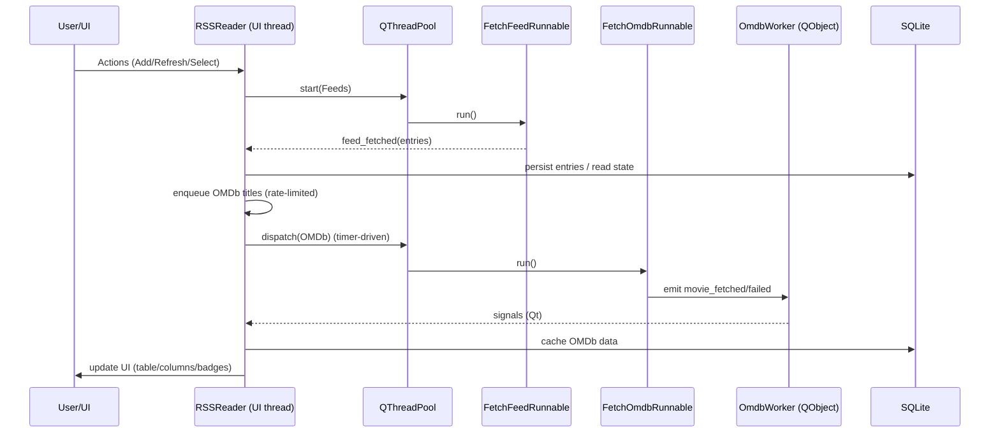

# Small RSS Reader

A minimal, native-feeling RSS Reader for macOS built with Python and PyQt5. Subscribe to feeds, browse and search articles, and optionally enrich movie-related items with OMDb data. Ships as a standalone .app bundle and is convenient to run from sources for development.


## Features

- Manage feeds: add, remove, and reorder with smart domain grouping.
- Article list with Title, Date, and optional OMDb columns (IMDb etc.).
- Unread indicators: blue dot for unread articles and unread badges per feed.
- Fast search across titles, summaries, and content.
- “Open in Browser” opens links in background on macOS (no focus steal).
- OMDb integration: per-feed toggle, async fetching, caching, and column selection.
- Customizable UI: icons-only toolbar, show/hide toolbar and menu bar; status bar removed.
- System tray integration and optional notifications.
- Import/Export: JSON and OPML. iCloud backup and restore.
- Auto refresh on a timer plus background refresh on startup.

## Quick start (from sources)

Prerequisites:
- macOS, Python 3.11+ recommended

Clone and run:

```bash
git clone https://github.com/SergeyLavrentev/small-rss-reader.git
cd small-rss-reader
make run
```

The first run creates a virtual environment, installs dependencies, and starts the app with extra debug logging.

## Build and install the macOS app bundle

The project uses py2app (via `setup.py`) and a simple Makefile.

- Build the .app bundle into `dist/`:

```bash
make build
```

- Install the app into `/Applications` (removes any existing bundle first) and ad-hoc sign it:

```bash
make install
```

- Optional: sign with your Developer ID certificate (set `SIGN_IDENTITY` in Makefile, then):

```bash
make codesign
```

- Clean and rebuild from scratch:

```bash
make full-rebuild
```

Notes:
- The Makefile always uses the local `venv/` and `python -m pip` for reproducibility.
- `install` currently uses ad-hoc signing (`-`). Use `codesign` target for Developer ID signing.

## Usage tips

- Add feeds via File → Add Feed…
- Per-feed OMDb toggle is in the feed context menu (right-click on a feed).
- When OMDb is enabled, right-click the article table header to choose which columns to show.
- View menu contains Show Toolbar and Show Menu Bar; visibility persists between runs.

## Architecture overview

High level
- UI: PyQt5 QMainWindow with a sidebar feed tree, article table, and embedded content view.
- Async work: QThreadPool + QRunnable for RSS and OMDb fetchers; rate-limited queue for OMDb.
- Persistence: SQLite (`db.sqlite3`) via a lightweight storage layer; QSettings for preferences/UI state.
- Packaging: py2app application bundle built via `make build`.
   - Re-exports `RSSReader` and `get_user_data_path` for tests.
- `rss_reader/app.py` — main application window and orchestration:
   - Builds menus, toolbar (icons-only), tray icon, splitter layout, search, and unread filter.
   - Manages feeds and articles, selection, unread/read state, badges, and opening links.
   - Background refresh, OMDb queueing, rate limiting, and UI updates.
- `storage.py` — SQLite access layer:
   - Tables: feeds, read_articles, group_settings (per-domain flags like `omdb_enabled`), column_widths, icon_cache, movie_cache.
   - Safe migration from legacy JSON on first run.
- `rss_reader/services/feeds.py` — feed fetching worker(s) and runnables.
- `rss_reader/services/omdb.py` — OMDb worker and runnable; emits success/failure signals.
- `rss_reader/ui/dialogs.py` — settings dialog (OMDb API key, iCloud backup, refresh, notifications, etc.).
- `rss_reader/utils/paths.py` — helpers for resource paths and user data location.

Threading model
- OMDb requests are de-duplicated by normalized title and limited by a timer-driven dispatcher.

### Diagrams

High-level module relationships:

```mermaid
graph LR
   entry[small_rss_reader.py]\n(splash + shim) --> app[rss_reader.app.RSSReader]
   app --> ui[ui/dialogs.py]
   app --> feeds[rss_reader/services/feeds.py]
   app --> omdb[rss_reader/services/omdb.py]
   app --> storage[storage.py]
   app --> paths[rss_reader/utils/paths.py]
   storage --> sqlite[(SQLite db.sqlite3)]
   feeds -. Qt signals .-> app
   omdb -. Qt signals .-> app
```

Threading and data flow:



Settings and state (QSettings keys)
- `window_geometry`, `window_state` — window size/state persistence.
- `toolbar_visible`, `menubar_visible` — UI visibility toggles.
- `omdb_api_key` — OMDb API key.
- `icloud_backup_enabled` — auto backup on close when data changed.
- Additional UI/state such as column widths are stored in SQLite.

## Data and backup

- Main database: `db.sqlite3` in the user data directory.
- iCloud backup folder: `~/Library/Mobile Documents/com~apple~CloudDocs/SmallRSSReaderBackup/`
   - `File → Backup to iCloud` copies the database there; restore is available via settings.

## OMDb integration

- Optional per-feed switch (context menu).
- When enabled and the IMDb column is visible, titles are resolved via OMDb asynchronously.
- Results are normalized and cached in SQLite to avoid duplicate requests.

## Testing

Run tests headless (Qt offscreen, WebEngine flags set by the Makefile):

```bash
make test        # unit tests without network
make test-all    # run all tests
make test-network
```

## Dependencies

- PyQt5, PyQtWebEngine
- feedparser
- omdb (and/or omdbapi), requests

## Troubleshooting

- If the app doesn’t start after an update, try:
   - `make clean` then `make run` (recreates venv and reinstalls deps)
   - `make full-rebuild` to rebuild the .app bundle from scratch

## Contributing

- Fork the repository and create a feature branch:
   - `git checkout -b feat/your-feature`
- Use the provided Makefile and venv (no global Python assumptions):
   - `make run` for local runs, `make test` to run tests headless
- Prefer small, focused commits with clear messages (e.g., `feat:`, `fix:`, `docs:`).
- Add or update tests when changing behavior.
- Open a PR with a concise description, screenshots (if UI), and testing notes.

